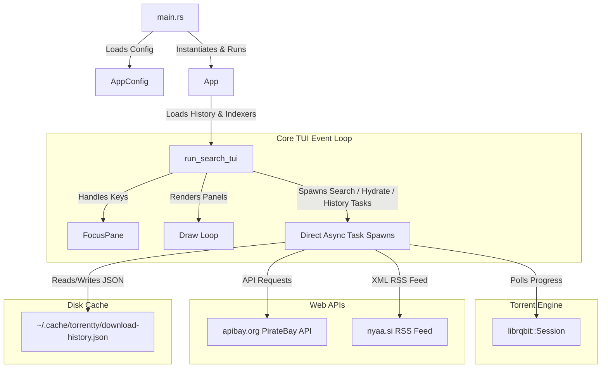

# Torrentty 🚀

> An ultra-fast, lightweight, and keyboard-driven BitTorrent search & download TUI for Linux.

[](https://www.rust-lang.org)
[](https://ratatui.rs)
[](https://github.com/nresare/rqbit)
[](#)
[](#)

**Torrentty** brings a streamlined, single-screen terminal interface to your torrent workflow. Combining concurrent multi-source indexer queries, robust magnet link hydration, and direct session downloading via `librqbit`, it delivers an optimized, lightweight console experience built entirely in Rust.

---

## ✨ Key Features

- ⚡ **Concurrent Indexer Queries:** Search across multiple public torrent indexes at the same time, merging and sorting results by seeders instantly.
- 🎒 **Highly Optimized Engine:** Optimized drawing pipelines and zero-allocation JSON parsing deliver fluid performance and minimal CPU overhead.
- 💾 **Persistent History Cache:** Completed downloads are tracked and cached locally, automatically restoring states on subsequent application launches.
- 🛠️ **Automatic Magnet Hydration:** Transparently resolves info-hashes to active magnet URI strings using local and remote metadata providers.
- 🎨 **Sleek Interface Styling:** Built with a Catppuccin Mocha-inspired theme for clean text rendering and readable console aesthetics.

---

## 🚀 Performance Pillars

We prioritize runtime speed, memory footprint, and binary distribution size equally:

- **0.0% Idle CPU Usage:** Realized via event-driven rendering updates (`needs_redraw` state tracking) rather than continuous ticks.
- **Minimal Heap Churn:** High-frequency rendering paths are rewritten to use stack-allocated arrays and `Cow<'_, str>` borrows, yielding a **~95% allocation reduction** in hot loops.
- **Compact 5.1 MB Binary Size:** Compiled utilizing global Link-Time Optimization (LTO), panic-aborts, and Native-TLS feature pruning.

---

## 🏗️ System Architecture & Component Design

The following diagram illustrates the streamlined layout of the application components and their relationships:



### 📁 File Structure & Component Map

| File / Module                                                                           | Purpose                                                                                                              | Key Symbols / Functions                                                                                                                                                                                                                                                            |
| :-------------------------------------------------------------------------------------- | :------------------------------------------------------------------------------------------------------------------- | :--------------------------------------------------------------------------------------------------------------------------------------------------------------------------------------------------------------------------------------------------------------------------------- |
| [main.rs](src/main.rs)       | Entry point of the program. Loads the application configuration and starts the main application loop.                | `main`                                                                                                                                                                                                                                                                             |
| [lib.rs](src/lib.rs)         | Module declarations making components reusable.                                                                      | Module list                                                                                                                                                                                                                                                                        |
| [app.rs](src/app.rs)         | Coordinates the main execution flow, starting the Session and passing indexers/history to the TUI.                   | [App](src/app.rs#L8)                                                                                                                                                                                                                                                               |
| [tui.rs](src/tui.rs)         | Manages the Terminal User Interface, event loops, visual rendering, key handling, and download handles.              | [SearchTui](src/tui.rs#L66), [run_search_tui](src/tui.rs#L47)                                                                                                                                                                                                                     |
| [indexer.rs](src/indexer.rs) | Integrates with public torrent indexers (PirateBay API, Nyaa RSS feed scraping) to perform concurrent queries.       | [search_piratebay](src/indexer.rs#L12), [search_nyaa](src/indexer.rs#L44)                                                                                                                                                                                                       |
| [storage.rs](src/storage.rs) | Serializes, deserializes, and prunes local download history records.                                                 | [DownloadHistoryEntry](src/storage.rs#L8)                                                                                                                                                                                                                                          |
| [types.rs](src/types.rs)     | Contains data structures representing configuration, search results, and serialized download states.                 | [Torrent](src/types.rs#L2)                                                                                                                                                                                                                                                         |
| [util.rs](src/util.rs)       | Utility functions for size formatting, URL encoding, magnet link assembly, and custom fallback JSON deserialization. | [format_size](src/util.rs#L5), [build_magnet_link](src/util.rs#L21)                                                                                                                                                                                                               |

---

## 🎮 Keyboard Controls

Torrentty is built for keyboard-first navigation:

| Key       | Action                                                                                     |
| :-------- | :----------------------------------------------------------------------------------------- |
| `Tab`     | Cycle focus between panels (Query Box $\rightarrow$ Results Table $\rightarrow$ Downloads) |
| `Enter`   | Trigger search (when query is focused) or start downloading selected result                |
| `↑` / `↓` | Navigate upward or downward in active lists/tables                                         |
| `?`       | Toggle the floating keyboard help overlay                                                  |
| `Esc`     | Close help popup or exit the application                                                   |

---

## 🛠️ Installation & Building

To build the release binary from source:

```bash
# Clone and enter the repository
git clone https://github.com/Aditya-233/Torrenty.git
cd Torrenty

# Compile the optimized release build
cargo build --release
```

The compiled binary will be located at `target/release/torrentty`.

---

## ⚙️ Configuration & Storage

Torrentty runs out of the box with sensible defaults, using your standard `Downloads` directory for torrent files. You can configure custom settings by creating a JSON configuration file.

### Custom Configuration Directory

Create or edit:

```text
~/.config/torrentty/config.json
```

**Example `config.json`:**

```json
{
  "rqbit": {
    "download_dir": "/home/yourusername/Downloads/Torrents"
  }
}
```

### Download History Storage

Completed downloads are stored and validated automatically in the cache:

```text
~/.cache/torrentty/download-history.json
```

_Note: If a previously completed torrent directory is deleted or moved, Torrentty automatically cleanses it from your history cache on startup._
